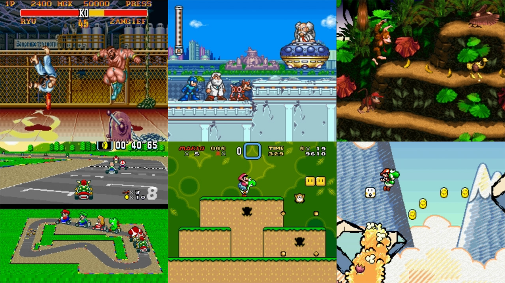

# Nintendo - SNES / SFC (bsnes 2014 Accuracy)

### Description

A libretro fork of bSNES. As close to upstream as possible.

The *Accuracy* profile focuses on accuracy at the cost of performance.

### License

GPLv3

### Icon

### Fanart

Help make me fanart!

### Screenshots

### Disclaimer

*In loving memory of Near / Byuu*
